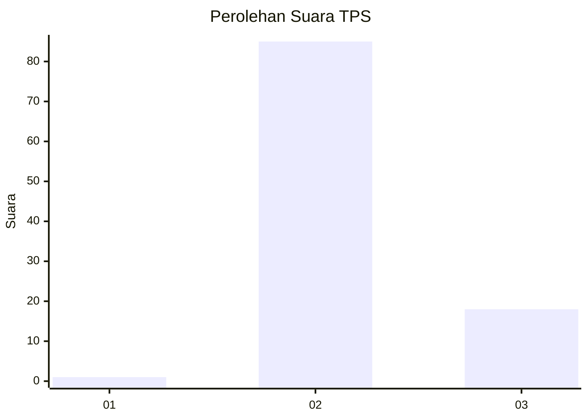
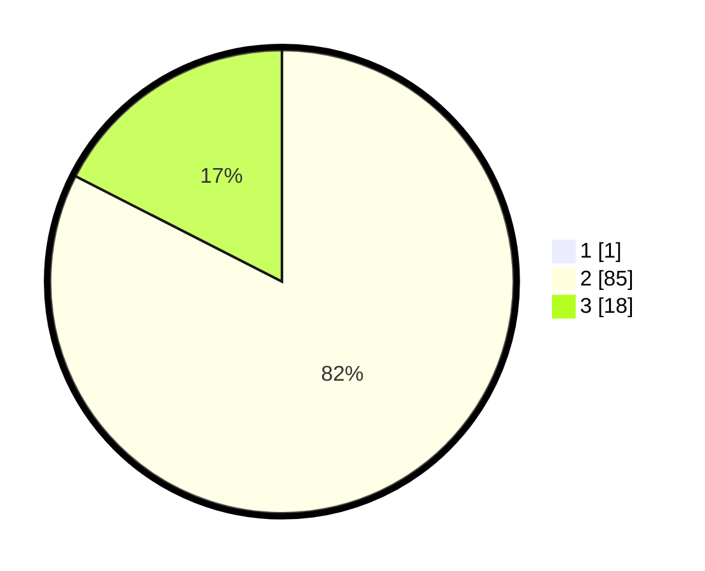

# Hasil

## Grafik

## Tabel

| No. | Nama Paslon    | Suara | Suara (raw) | Persentase |
|:--- |:-------------- | -----:| -----------:| ----------:|
| 1   | ANIES MUHAIMIN | 1     | [1][p-1]    | 0,96       |
| 2   | PRABOWO GIBRAN | 85    | [85][p-2]   | 81,73      |
| 3   | GANJAR MAHFUD  | 18    | [18][p-3]   | 17,31      |

[p-1]: https://github.com/gigit-pemilu/pemilu-2024-53-nusa-tenggara-timur/blob/main/pilpres/hitung-suara/sub/53-nusa-tenggara-timur/sub/21-malaka/sub/12-botin-leobele/sub/2002-kereana/sub/003-tps/sub/paslon-1.txt
[p-2]: https://github.com/gigit-pemilu/pemilu-2024-53-nusa-tenggara-timur/blob/main/pilpres/hitung-suara/sub/53-nusa-tenggara-timur/sub/21-malaka/sub/12-botin-leobele/sub/2002-kereana/sub/003-tps/sub/paslon-2.txt
[p-3]: https://github.com/gigit-pemilu/pemilu-2024-53-nusa-tenggara-timur/blob/main/pilpres/hitung-suara/sub/53-nusa-tenggara-timur/sub/21-malaka/sub/12-botin-leobele/sub/2002-kereana/sub/003-tps/sub/paslon-3.txt

## Foto C Plano

https://sirekap-obj-formc.kpu.go.id/dcbd/pemilu/ppwp/53/21/12/20/02/5321122002003-20240215-072810--c438cba3-1f89-4aba-a356-e8cc8415009d.jpg

https://sirekap-obj-formc.kpu.go.id/dcbd/pemilu/ppwp/53/21/12/20/02/5321122002003-20240215-072932--41887045-7d91-4534-8b3d-1545f7b72828.jpg

https://sirekap-obj-formc.kpu.go.id/dcbd/pemilu/ppwp/53/21/12/20/02/5321122002003-20240215-073101--ed0d7e0d-ba92-4148-9749-ceff8d1956c1.jpg

## Metadata

| Key        | Value               |
| ---------- | ------------------- |
| Time Stamp | 2024-02-16 09:00:28 |

