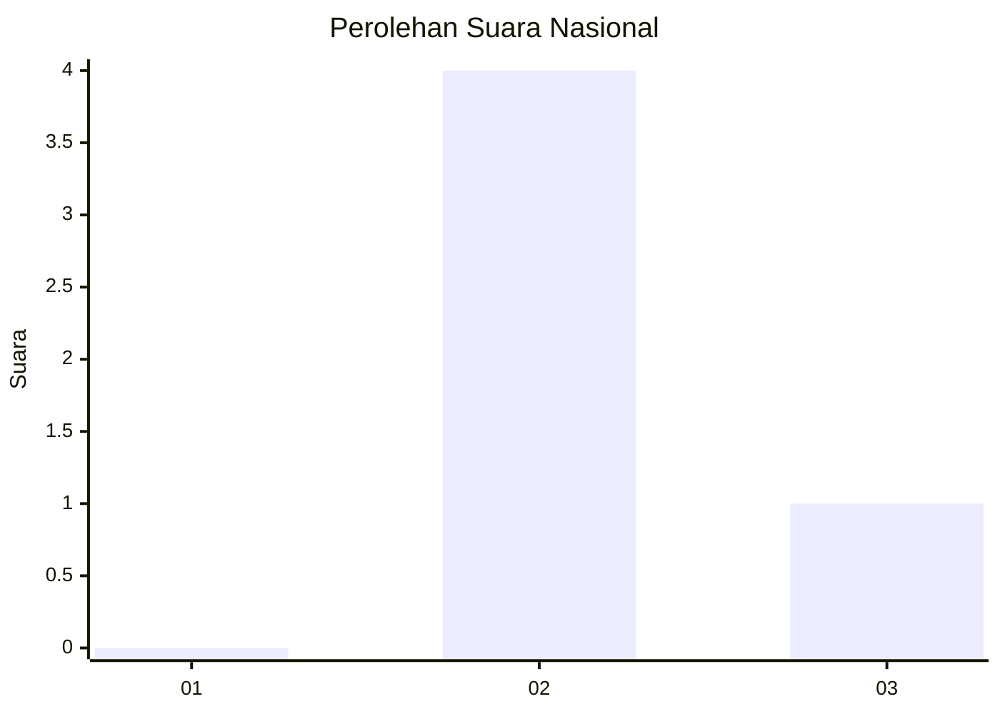
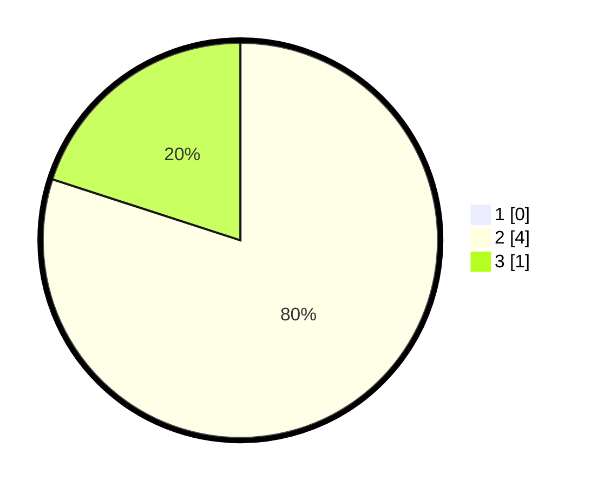

# Hasil

## Grafik

## Tabel

| No. | Nama Paslon    | Suara | Suara (raw) | Persentase |
|:--- |:-------------- | -----:| -----------:| ----------:|
| 1   | ANIES MUHAIMIN | 0     | [0][p-1]    | 0,00       |
| 2   | PRABOWO GIBRAN | 4     | [4][p-2]    | 80,00      |
| 3   | GANJAR MAHFUD  | 1     | [1][p-3]    | 20,00      |

[p-1]: https://github.com/gigit-pemilu/pemilu-2024/blob/main/pilpres/hitung-suara/sub/53-nusa-tenggara-timur/sub/71-kota-kupang/sub/01-alak/sub/1012-penkase-oeleta/sub/005-tps/sub/paslon-1.txt
[p-2]: https://github.com/gigit-pemilu/pemilu-2024/blob/main/pilpres/hitung-suara/sub/53-nusa-tenggara-timur/sub/71-kota-kupang/sub/01-alak/sub/1012-penkase-oeleta/sub/005-tps/sub/paslon-2.txt
[p-3]: https://github.com/gigit-pemilu/pemilu-2024/blob/main/pilpres/hitung-suara/sub/53-nusa-tenggara-timur/sub/71-kota-kupang/sub/01-alak/sub/1012-penkase-oeleta/sub/005-tps/sub/paslon-3.txt

## Foto C Plano

https://sirekap-obj-formc.kpu.go.id/6488/pemilu/ppwp/53/71/01/10/12/5371011012005-20240223-142450--6a8d978c-a002-4916-8756-3462dcf70eac.jpg

https://sirekap-obj-formc.kpu.go.id/6488/pemilu/ppwp/53/71/01/10/12/5371011012005-20240223-142552--c9137b86-e385-4197-9430-897a09af3250.jpg

https://sirekap-obj-formc.kpu.go.id/6488/pemilu/ppwp/53/71/01/10/12/5371011012005-20240223-142647--869a9a15-741d-403b-b3a6-686e13954db9.jpg

## Metadata

| Key        | Value               |
| ---------- | ------------------- |
| Time Stamp | 2024-02-24 22:31:28 |

## DATA PEMILIH TETAP

Jumlah pemilih dalam DPT: **4**.
 * L: **0**.
 * P: **0**.

## DATA PENGGUNA HAK PILIH

Jumlah pengguna hak pilih dalam DPT: **408**.
 * L: **55**.
 * P: **700**.

Jumlah pengguna hak pilih dalam DPTb: **0**.
 * L: **725**.
 * P: **200**.

Jumlah pengguna hak pilih dalam DPK: **551**.
 * L: **0**.
 * P: **7**.

Jumlah pengguna hak pilih: **551**.
 * L: **87**.
 * P: **97**.

## JUMLAH SUARA SAH DAN TIDAK SAH

JUMLAH SELURUH SUARA SAH: **2**.

JUMLAH SUARA TIDAK SAH: **0**.

JUMLAH SELURUH SUARA SAH DAN SUARA TIDAK SAH: **7**.

