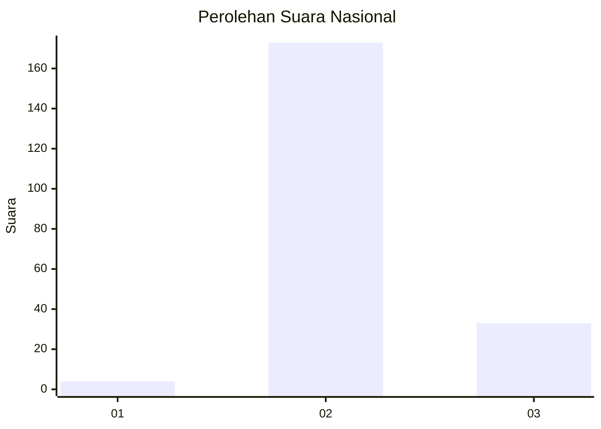
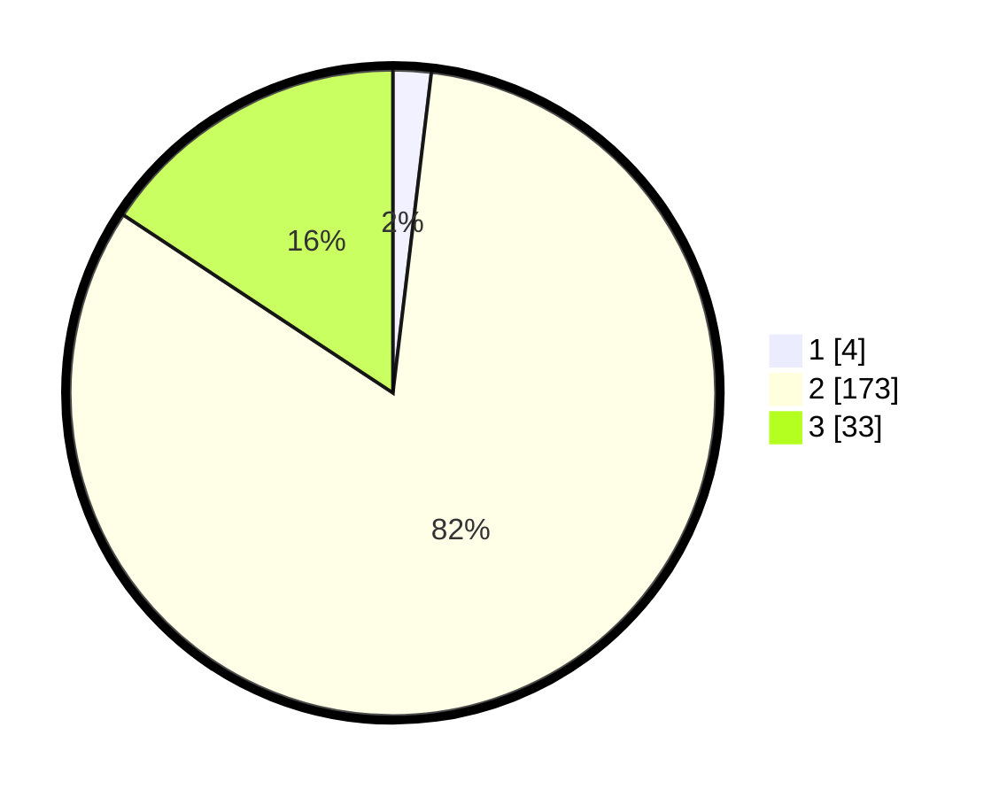

# Hasil

## Grafik

## Tabel

| No. | Nama Paslon    | Suara | Suara (raw) | Persentase |
|:--- |:-------------- | -----:| -----------:| ----------:|
| 1   | ANIES MUHAIMIN | 4     | [4][p-1]    | 1,90       |
| 2   | PRABOWO GIBRAN | 173   | [173][p-2]  | 82,38      |
| 3   | GANJAR MAHFUD  | 33    | [33][p-3]   | 15,71      |

[p-1]: https://github.com/gigit-pemilu/pemilu-2024/blob/main/pilpres/hitung-suara/sub/53-nusa-tenggara-timur/sub/71-kota-kupang/sub/02-maulafa/sub/1001-oepura/sub/005-tps/sub/paslon-1.txt
[p-2]: https://github.com/gigit-pemilu/pemilu-2024/blob/main/pilpres/hitung-suara/sub/53-nusa-tenggara-timur/sub/71-kota-kupang/sub/02-maulafa/sub/1001-oepura/sub/005-tps/sub/paslon-2.txt
[p-3]: https://github.com/gigit-pemilu/pemilu-2024/blob/main/pilpres/hitung-suara/sub/53-nusa-tenggara-timur/sub/71-kota-kupang/sub/02-maulafa/sub/1001-oepura/sub/005-tps/sub/paslon-3.txt

## Foto C Plano

https://sirekap-obj-formc.kpu.go.id/3601/pemilu/ppwp/53/71/02/10/01/5371021001005-20240215-045515--d7cfc931-6908-4c9f-904d-8a4150d3bff3.jpg

https://sirekap-obj-formc.kpu.go.id/3601/pemilu/ppwp/53/71/02/10/01/5371021001005-20240215-045617--2d0624ab-0419-403d-9022-5152d88c9892.jpg

https://sirekap-obj-formc.kpu.go.id/3601/pemilu/ppwp/53/71/02/10/01/5371021001005-20240215-045657--d5ab63d8-8adc-40a8-8a61-29355b49b6d6.jpg

## Metadata

| Key        | Value               |
| ---------- | ------------------- |
| Time Stamp | 2024-02-15 22:00:27 |

