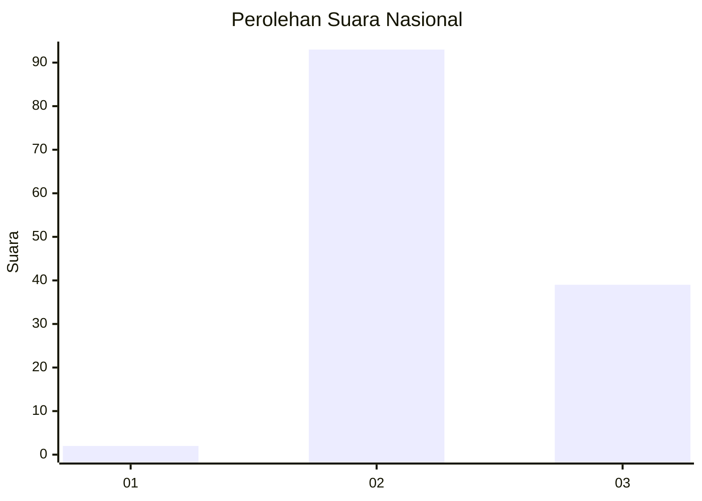
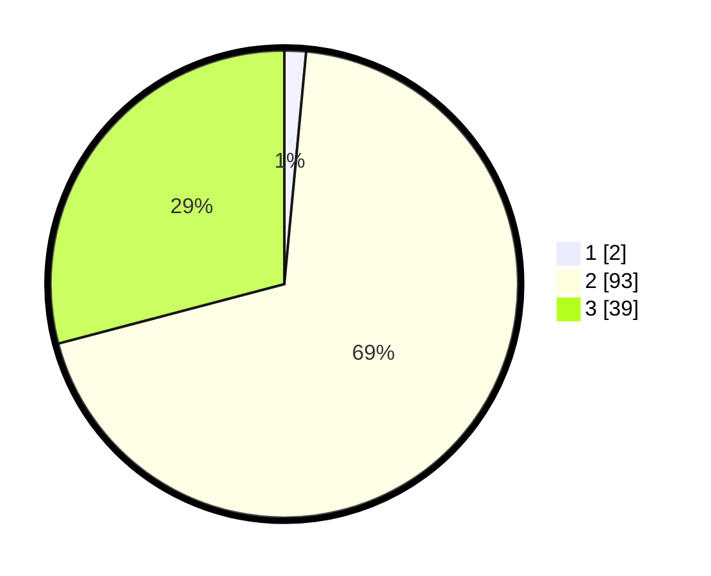

# Hasil

## Grafik

## Tabel

| No. | Nama Paslon    | Suara | Suara (raw) | Persentase |
|:--- |:-------------- | -----:| -----------:| ----------:|
| 1   | ANIES MUHAIMIN | 2     | [2][p-1]    | 1,49       |
| 2   | PRABOWO GIBRAN | 93    | [93][p-2]   | 69,40      |
| 3   | GANJAR MAHFUD  | 39    | [39][p-3]   | 29,10      |

[p-1]: https://github.com/gigit-pemilu/pemilu-2024/blob/main/pilpres/hitung-suara/sub/53-nusa-tenggara-timur/sub/71-kota-kupang/sub/02-maulafa/sub/1001-oepura/sub/006-tps/sub/paslon-1.txt
[p-2]: https://github.com/gigit-pemilu/pemilu-2024/blob/main/pilpres/hitung-suara/sub/53-nusa-tenggara-timur/sub/71-kota-kupang/sub/02-maulafa/sub/1001-oepura/sub/006-tps/sub/paslon-2.txt
[p-3]: https://github.com/gigit-pemilu/pemilu-2024/blob/main/pilpres/hitung-suara/sub/53-nusa-tenggara-timur/sub/71-kota-kupang/sub/02-maulafa/sub/1001-oepura/sub/006-tps/sub/paslon-3.txt

## Foto C Plano

https://sirekap-obj-formc.kpu.go.id/5be7/pemilu/ppwp/53/71/02/10/01/5371021001006-20240214-215334--64d839b0-6831-421a-b87c-5da35bbcd6d8.jpg

https://sirekap-obj-formc.kpu.go.id/5be7/pemilu/ppwp/53/71/02/10/01/5371021001006-20240214-215417--4a6f92df-df14-40bc-b689-c1f228ff228d.jpg

https://sirekap-obj-formc.kpu.go.id/5be7/pemilu/ppwp/53/71/02/10/01/5371021001006-20240214-215459--29c3bcfb-b716-4bcd-86ad-e64d6b810253.jpg

## Metadata

| Key        | Value               |
| ---------- | ------------------- |
| Time Stamp | 2024-02-15 22:00:27 |

