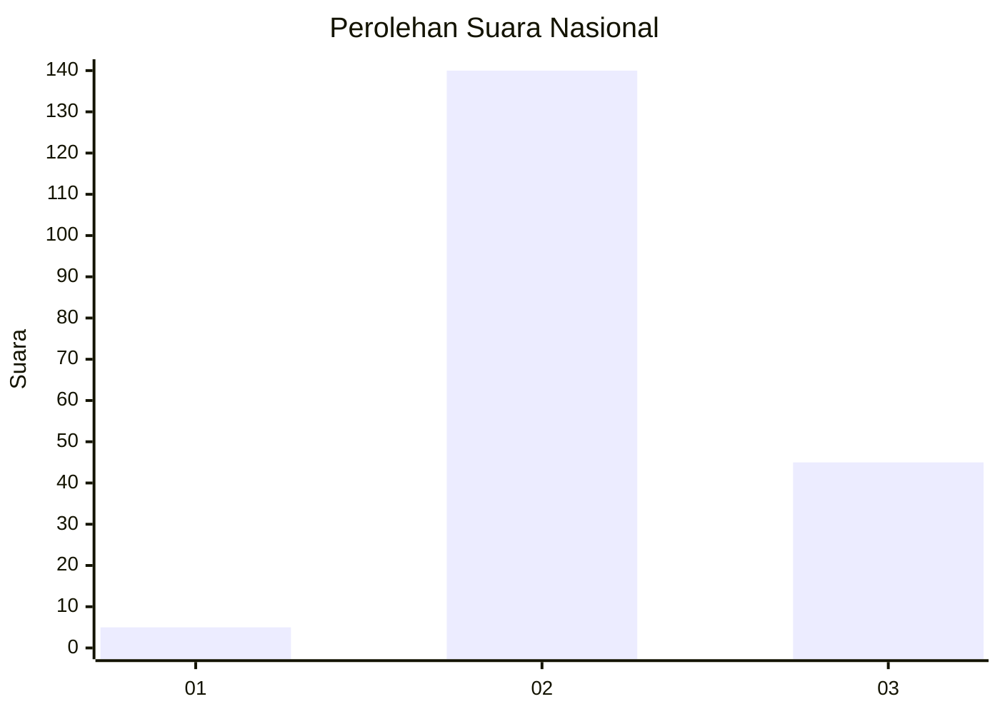
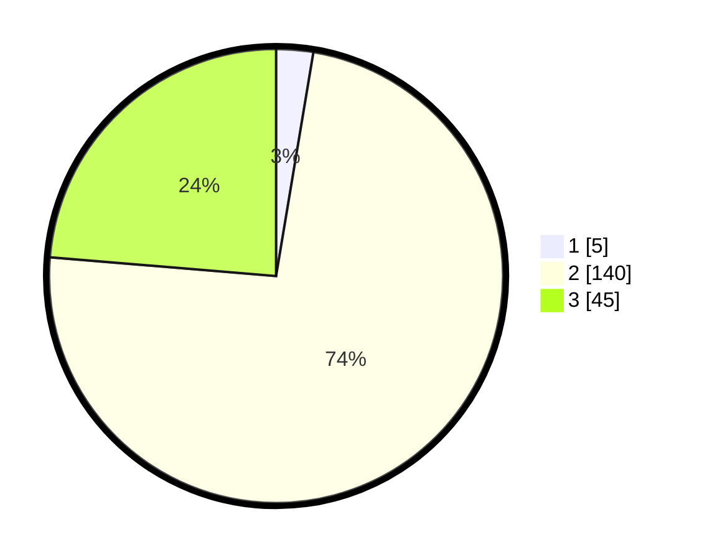

# Hasil

## Grafik

## Tabel

| No. | Nama Paslon    | Suara | Suara (raw) | Persentase |
|:--- |:-------------- | -----:| -----------:| ----------:|
| 1   | ANIES MUHAIMIN | 5     | [5][p-1]    | 2,63       |
| 2   | PRABOWO GIBRAN | 140   | [140][p-2]  | 73,68      |
| 3   | GANJAR MAHFUD  | 45    | [45][p-3]   | 23,68      |

[p-1]: https://github.com/gigit-pemilu/pemilu-2024/blob/main/pilpres/hitung-suara/sub/53-nusa-tenggara-timur/sub/71-kota-kupang/sub/03-kelapa-lima/sub/1001-kelapa-lima/sub/003-tps/sub/paslon-1.txt
[p-2]: https://github.com/gigit-pemilu/pemilu-2024/blob/main/pilpres/hitung-suara/sub/53-nusa-tenggara-timur/sub/71-kota-kupang/sub/03-kelapa-lima/sub/1001-kelapa-lima/sub/003-tps/sub/paslon-2.txt
[p-3]: https://github.com/gigit-pemilu/pemilu-2024/blob/main/pilpres/hitung-suara/sub/53-nusa-tenggara-timur/sub/71-kota-kupang/sub/03-kelapa-lima/sub/1001-kelapa-lima/sub/003-tps/sub/paslon-3.txt

## Foto C Plano

https://sirekap-obj-formc.kpu.go.id/1d69/pemilu/ppwp/53/71/03/10/01/5371031001003-20240214-222919--4cc80a74-caa5-436c-9af6-8213ada80fd5.jpg

https://sirekap-obj-formc.kpu.go.id/1d69/pemilu/ppwp/53/71/03/10/01/5371031001003-20240214-223040--737f44be-d886-49d7-bdfa-046556eefed0.jpg

https://sirekap-obj-formc.kpu.go.id/1d69/pemilu/ppwp/53/71/03/10/01/5371031001003-20240214-223122--e1eb2754-4b4c-48dd-87ec-9a5f41a15bcc.jpg

## Metadata

| Key        | Value               |
| ---------- | ------------------- |
| Time Stamp | 2024-02-15 15:00:29 |

