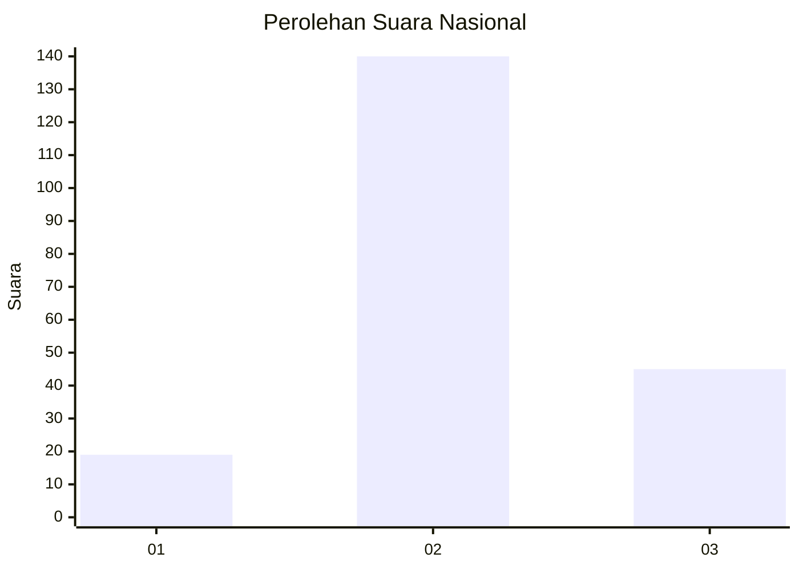
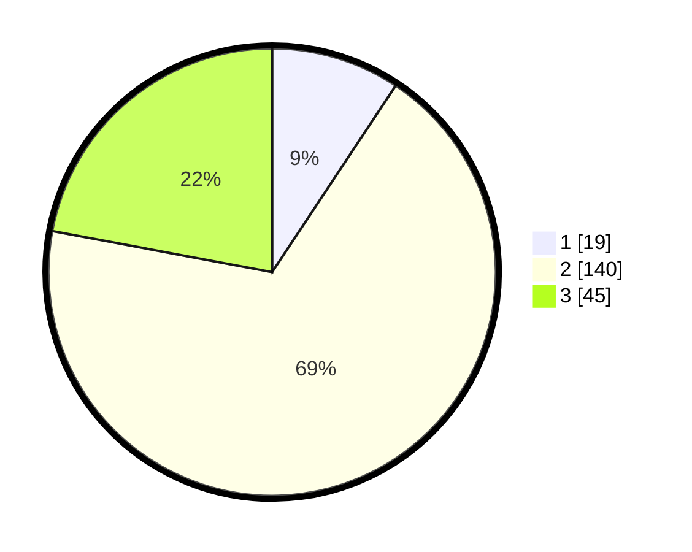

# Hasil

## Grafik

## Tabel

| No. | Nama Paslon    | Suara | Suara (raw) | Persentase |
|:--- |:-------------- | -----:| -----------:| ----------:|
| 1   | ANIES MUHAIMIN | 19    | [19][p-1]   | 9,31       |
| 2   | PRABOWO GIBRAN | 140   | [140][p-2]  | 68,63      |
| 3   | GANJAR MAHFUD  | 45    | [45][p-3]   | 22,06      |

[p-1]: https://github.com/gigit-pemilu/pemilu-2024/blob/main/pilpres/hitung-suara/sub/53-nusa-tenggara-timur/sub/71-kota-kupang/sub/04-oebobo/sub/1001-oebobo/sub/004-tps/sub/paslon-1.txt
[p-2]: https://github.com/gigit-pemilu/pemilu-2024/blob/main/pilpres/hitung-suara/sub/53-nusa-tenggara-timur/sub/71-kota-kupang/sub/04-oebobo/sub/1001-oebobo/sub/004-tps/sub/paslon-2.txt
[p-3]: https://github.com/gigit-pemilu/pemilu-2024/blob/main/pilpres/hitung-suara/sub/53-nusa-tenggara-timur/sub/71-kota-kupang/sub/04-oebobo/sub/1001-oebobo/sub/004-tps/sub/paslon-3.txt

## Foto C Plano

https://sirekap-obj-formc.kpu.go.id/9d3d/pemilu/ppwp/53/71/04/10/01/5371041001004-20240215-011546--6baa697d-89a5-4b68-933a-61288729c83a.jpg

https://sirekap-obj-formc.kpu.go.id/9d3d/pemilu/ppwp/53/71/04/10/01/5371041001004-20240215-011800--e67c919f-8501-427a-9804-4f30322580ba.jpg

https://sirekap-obj-formc.kpu.go.id/9d3d/pemilu/ppwp/53/71/04/10/01/5371041001004-20240215-011925--f25440c3-a74c-40be-a5ea-7aba2a231df4.jpg

## Metadata

| Key        | Value               |
| ---------- | ------------------- |
| Time Stamp | 2024-02-15 12:00:28 |

