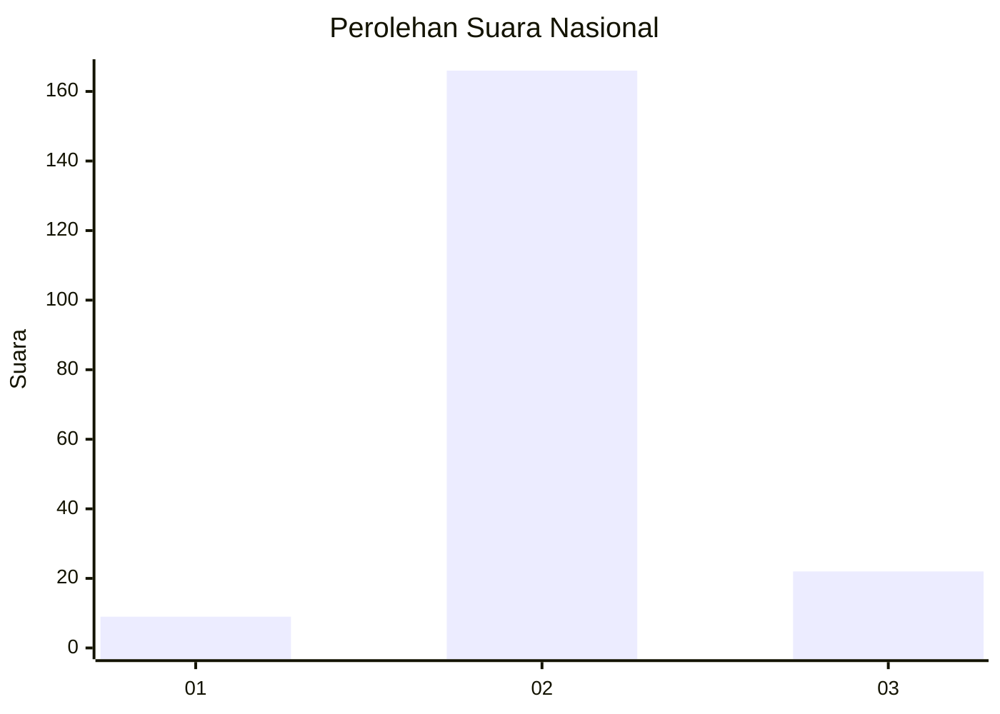
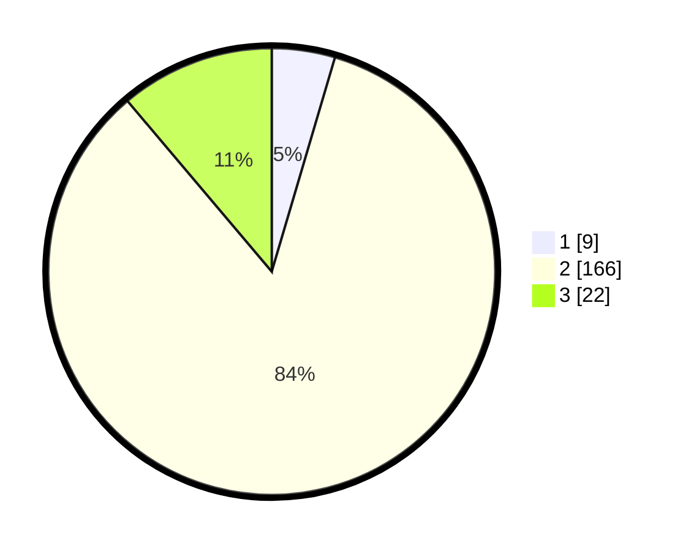

# Hasil

## Grafik

## Tabel

| No. | Nama Paslon    | Suara | Suara (raw) | Persentase |
|:--- |:-------------- | -----:| -----------:| ----------:|
| 1   | ANIES MUHAIMIN | 9     | [9][p-1]    | 4,57       |
| 2   | PRABOWO GIBRAN | 166   | [166][p-2]  | 84,26      |
| 3   | GANJAR MAHFUD  | 22    | [22][p-3]   | 11,17      |

[p-1]: https://github.com/gigit-pemilu/pemilu-2024/blob/main/pilpres/hitung-suara/sub/53-nusa-tenggara-timur/sub/71-kota-kupang/sub/05-kota-raja/sub/1001-bakunase/sub/002-tps/sub/paslon-1.txt
[p-2]: https://github.com/gigit-pemilu/pemilu-2024/blob/main/pilpres/hitung-suara/sub/53-nusa-tenggara-timur/sub/71-kota-kupang/sub/05-kota-raja/sub/1001-bakunase/sub/002-tps/sub/paslon-2.txt
[p-3]: https://github.com/gigit-pemilu/pemilu-2024/blob/main/pilpres/hitung-suara/sub/53-nusa-tenggara-timur/sub/71-kota-kupang/sub/05-kota-raja/sub/1001-bakunase/sub/002-tps/sub/paslon-3.txt

## Foto C Plano

https://sirekap-obj-formc.kpu.go.id/f088/pemilu/ppwp/53/71/05/10/01/5371051001002-20240214-160131--02bb73a6-b928-4a94-a22b-05b02335bd13.jpg

https://sirekap-obj-formc.kpu.go.id/f088/pemilu/ppwp/53/71/05/10/01/5371051001002-20240214-155757--f0bf5f6b-ce89-4ba2-ad2b-3c68d14b1261.jpg

https://sirekap-obj-formc.kpu.go.id/f088/pemilu/ppwp/53/71/05/10/01/5371051001002-20240214-155838--cbf7e7b2-c786-4ceb-b9d8-a9f52d813b75.jpg

## Metadata

| Key        | Value               |
| ---------- | ------------------- |
| Time Stamp | 2024-02-15 21:30:27 |

