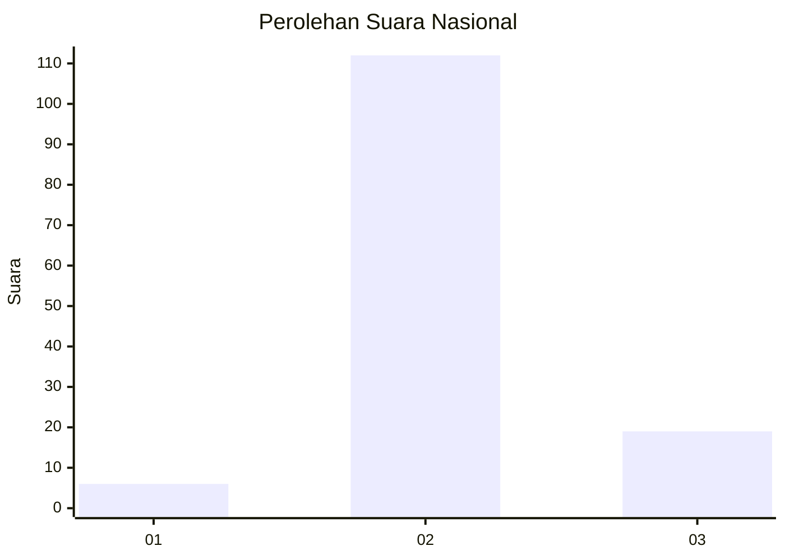
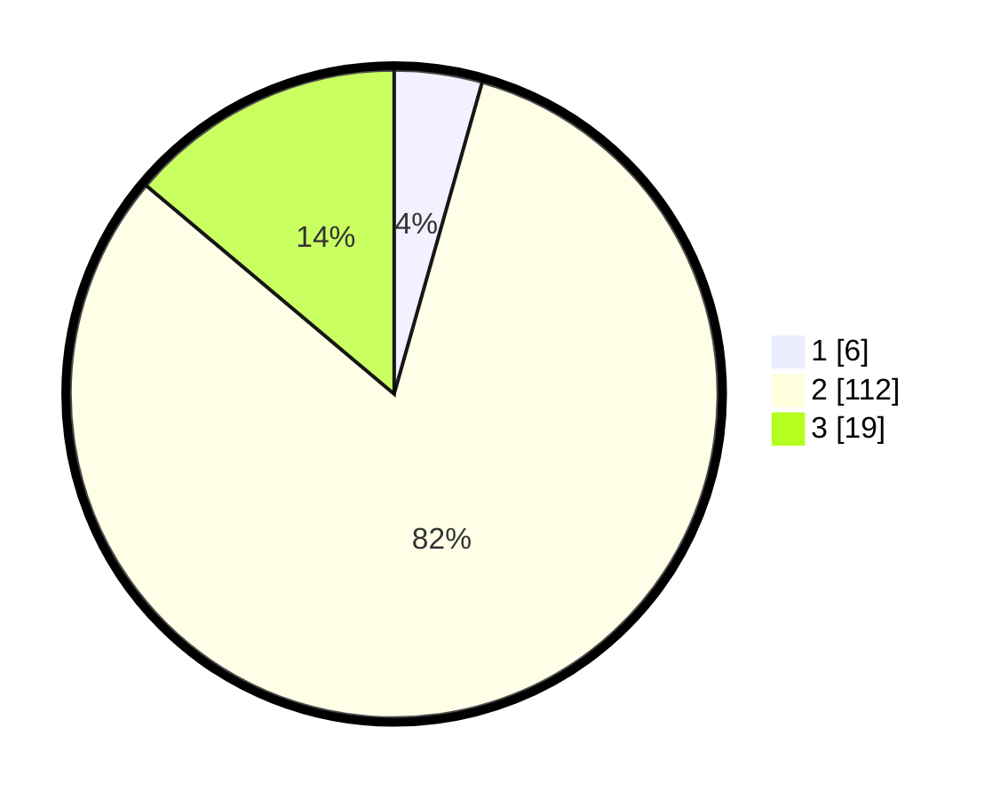

# Hasil

## Grafik

## Tabel

| No. | Nama Paslon    | Suara | Suara (raw) | Persentase |
|:--- |:-------------- | -----:| -----------:| ----------:|
| 1   | ANIES MUHAIMIN | 6     | [6][p-1]    | 4,38       |
| 2   | PRABOWO GIBRAN | 112   | [112][p-2]  | 81,75      |
| 3   | GANJAR MAHFUD  | 19    | [19][p-3]   | 13,87      |

[p-1]: https://github.com/gigit-pemilu/pemilu-2024/blob/main/pilpres/hitung-suara/sub/53-nusa-tenggara-timur/sub/71-kota-kupang/sub/05-kota-raja/sub/1001-bakunase/sub/005-tps/sub/paslon-1.txt
[p-2]: https://github.com/gigit-pemilu/pemilu-2024/blob/main/pilpres/hitung-suara/sub/53-nusa-tenggara-timur/sub/71-kota-kupang/sub/05-kota-raja/sub/1001-bakunase/sub/005-tps/sub/paslon-2.txt
[p-3]: https://github.com/gigit-pemilu/pemilu-2024/blob/main/pilpres/hitung-suara/sub/53-nusa-tenggara-timur/sub/71-kota-kupang/sub/05-kota-raja/sub/1001-bakunase/sub/005-tps/sub/paslon-3.txt

## Foto C Plano

https://sirekap-obj-formc.kpu.go.id/185c/pemilu/ppwp/53/71/05/10/01/5371051001005-20240214-234901--f241a1b3-6b6f-489c-b5f1-bfa295339fce.jpg

https://sirekap-obj-formc.kpu.go.id/185c/pemilu/ppwp/53/71/05/10/01/5371051001005-20240214-235045--01ac07d0-af79-47d0-b508-64765dd882bb.jpg

https://sirekap-obj-formc.kpu.go.id/185c/pemilu/ppwp/53/71/05/10/01/5371051001005-20240214-235258--db50ca6b-f6cb-488a-a9c8-e2b1c70a0f0d.jpg

## Metadata

| Key        | Value               |
| ---------- | ------------------- |
| Time Stamp | 2024-02-15 21:30:27 |

